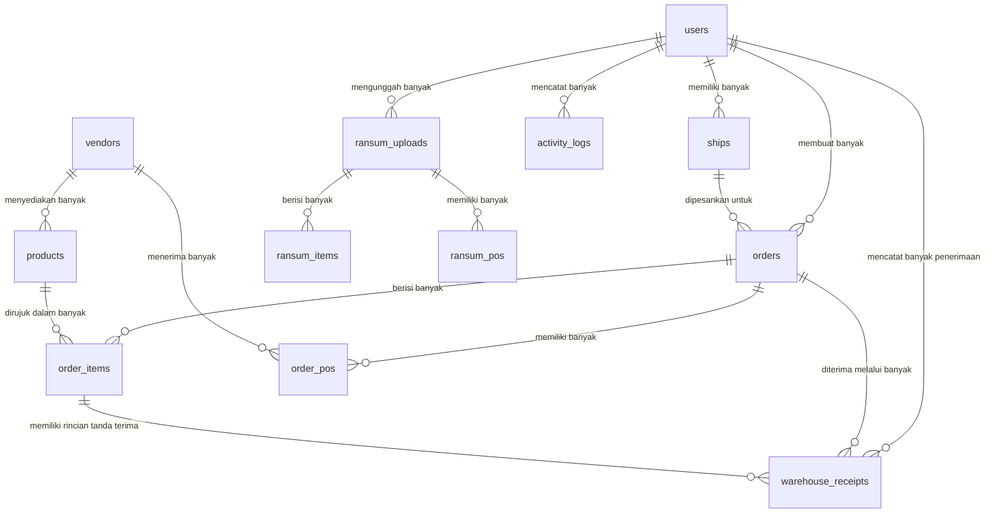

# Panduan Arsitektur Backend & Skema Database

Dokumen ini menyediakan tinjauan komprehensif tentang struktur backend, tabel-tabel utama, dan hubungan antar entitas (ER Diagram) pada aplikasi **Ship Order**.

---

## 1. Diagram Hubungan Entitas (ER Diagram)

Berikut adalah peta visual tabel database beserta hubungannya:

---

## 2. Rincian Tabel & Relasi

### A. Manajemen Pengguna Utama

#### 1. `users` (Pengguna)
Mempresentasikan akun pengguna di dalam sistem, dikelompokkan berdasarkan peran: **Admin**, **Warehouse (Gudang)**, atau **User (Pengguna Biasa)**.
- **Kunci**: `id` (PK)
- **Relasi**:
  - `hasMany` (memiliki banyak) [ships](file:///d:/Github/Conversion/app/Models/Ship.php)
  - `hasMany` (memiliki banyak) [orders](file:///d:/Github/Conversion/app/Models/Order.php)
  - `hasMany` (memiliki banyak) [ransum_uploads](file:///d:/Github/Conversion/app/Models/RansumUpload.php)
  - `hasMany` (memiliki banyak) [activity_logs](file:///d:/Github/Conversion/app/Models/ActivityLog.php)

#### 2. `ships` (Kapal)
Data kapal yang terdaftar di bawah akun pengguna (User).
- **Kunci**: `id` (PK), `user_id` (FK -> `users.id`)
- **Relasi**:
  - `belongsTo` (dimiliki oleh) [users](file:///d:/Github/Conversion/app/Models/User.php)
  - `hasMany` (memiliki banyak) [orders](file:///d:/Github/Conversion/app/Models/Order.php)

---

### B. Sistem Pemesanan Standar (Orders)

#### 3. `orders` (Pesanan)
Log pesanan utama yang diajukan oleh pengguna biasa untuk kapal mereka.
- **Kunci**: `id` (PK), `user_id` (FK -> `users.id`), `ship_id` (FK -> `ships.id`)
- **Relasi**:
  - `belongsTo` (dimiliki oleh) [users](file:///d:/Github/Conversion/app/Models/User.php)
  - `belongsTo` (dimiliki oleh) [ships](file:///d:/Github/Conversion/app/Models/Ship.php)
  - `hasMany` (memiliki banyak) [order_items](file:///d:/Github/Conversion/app/Models/OrderItem.php)
  - `hasMany` (memiliki banyak) [order_pos](file:///d:/Github/Conversion/app/Models/OrderPo.php)

#### 4. `order_items` (Item Pesanan)
Baris produk/item individu yang terhubung ke pesanan tertentu.
- **Kunci**: `id` (PK), `order_id` (FK -> `orders.id`), `product_id` (FK -> `products.id`)
- **Relasi**:
  - `belongsTo` (dimiliki oleh) [orders](file:///d:/Github/Conversion/app/Models/Order.php)
  - `belongsTo` (dimiliki oleh) [products](file:///d:/Github/Conversion/app/Models/Product.php)
  - `hasMany` (memiliki banyak) [warehouse_receipts](file:///d:/Github/Conversion/app/Models/WarehouseReceipt.php)

#### 5. `order_pos` (PO Pesanan)
Purchase Order (Surat Pesanan) yang dibuat dari pesanan standar, dikelompokkan per Vendor.
- **Kunci**: `id` (PK), `order_id` (FK -> `orders.id`), `vendor_id` (FK -> `vendors.id`)
- **Relasi**:
  - `belongsTo` (dimiliki oleh) [orders](file:///d:/Github/Conversion/app/Models/Order.php)
  - `belongsTo` (dimiliki oleh) [vendors](file:///d:/Github/Conversion/app/Models/Vendor.php)

#### 6. `warehouse_receipts` (Penerimaan Gudang)
Dokumen pemeriksaan penerimaan barang yang dibuat oleh staf Gudang (Warehouse) saat barang pesanan tiba.
- **Kunci**: `id` (PK), `order_id` (FK -> `orders.id`), `order_item_id` (FK -> `order_items.id`), `recorded_by` (FK -> `users.id`)
- **Relasi**:
  - `belongsTo` (dimiliki oleh) [orders](file:///d:/Github/Conversion/app/Models/Order.php)
  - `belongsTo` (dimiliki oleh) [order_items](file:///d:/Github/Conversion/app/Models/OrderItem.php)
  - `belongsTo` (dimiliki oleh) [users](file:///d:/Github/Conversion/app/Models/User.php) (sebagai pencatat/staf gudang)

---

### C. Vendor & Katalog Produk

#### 7. `vendors` (Pemasok)
Pihak pemasok/penyedia barang untuk kapal-kapal Meratus.
- **Kunci**: `id` (PK)
- **Relasi**:
  - `hasMany` (memiliki banyak) [products](file:///d:/Github/Conversion/app/Models/Product.php)
  - `hasMany` (memiliki banyak) [order_pos](file:///d:/Github/Conversion/app/Models/OrderPo.php)

#### 8. `products` (Produk)
Katalog produk master yang disediakan oleh masing-masing Vendor.
- **Kunci**: `id` (PK), `vendor_id` (FK -> `vendors.id`)
- **Relasi**:
  - `belongsTo` (dimiliki oleh) [vendors](file:///d:/Github/Conversion/app/Models/Vendor.php)
  - `hasMany` (memiliki banyak) [order_items](file:///d:/Github/Conversion/app/Models/OrderItem.php)

---

### D. Operasi Unggah Excel Ransum

#### 9. `ransum_uploads` (Unggahan Ransum)
Metadata riwayat berkas Excel yang diunggah berisi dokumen lampiran BPB Ransum.
- **Kunci**: `id` (PK), `uploaded_by` (FK -> `users.id`)
- **Relasi**:
  - `belongsTo` (dimiliki oleh) [users](file:///d:/Github/Conversion/app/Models/User.php) (sebagai pengunggah berkas)
  - `hasMany` (memiliki banyak) [ransum_items](file:///d:/Github/Conversion/app/Models/RansumItem.php)
  - `hasMany` (memiliki banyak) [ransum_pos](file:///d:/Github/Conversion/app/Models/RansumPo.php)

#### 10. `ransum_items` (Item Ransum)
Draf maupun data final barang ransum yang diekstrak dan diimpor dari berkas Excel Ransum yang diunggah.
- **Kunci**: `id` (PK), `ransum_upload_id` (FK -> `ransum_uploads.id`)
- **Relasi**:
  - `belongsTo` (dimiliki oleh) [ransum_uploads](file:///d:/Github/Conversion/app/Models/RansumUpload.php)

#### 11. `ransum_pos` (PO Ransum)
Purchase Order (PO) yang dibuat dan diekspor untuk vendor tertentu berdasarkan kecocokan item ransum.
- **Kunci**: `id` (PK), `ransum_upload_id` (FK -> `ransum_uploads.id`)
- **Relasi**:
  - `belongsTo` (dimiliki oleh) [ransum_uploads](file:///d:/Github/Conversion/app/Models/RansumUpload.php)

---

### E. Jejak Log Sistem

#### 12. `activity_logs` (Log Aktivitas)
Tabel riwayat audit log yang melacak semua aksi pembuatan, pembaruan, pengunduhan dokumen, dan penghapusan data oleh Admin.
- **Kunci**: `id` (PK), `user_id` (FK -> `users.id`)
- **Relasi**:
  - `belongsTo` (dimiliki oleh) [users](file:///d:/Github/Conversion/app/Models/User.php)

---

## 3. Arsitektur Backend & Alur Kerja Kontroler

Sisi backend aplikasi dibangun di atas framework **Laravel 12+** menggunakan pola arsitektur MVC (Model-View-Controller). Backend ini menerapkan middleware kustom, penyimpanan lokal privat yang aman, serta pemrosesan file dinamis.

### A. Perutean & Kontrol Akses (Middleware)
Kontrol keamanan akses halaman diterapkan pada lapis perutean (routing) menggunakan tiga jenis middleware utama:
1. **`auth` / `verified`**: Menjamin bahwa pengguna telah masuk dan memiliki sesi aktif.
2. **`AdminMiddleware`**: Membatasi rute dengan awalan `/admin` (seperti pembuatan akun, pengeditan katalog produk, dan histori log aktivitas) agar hanya bisa diakses oleh pengguna dengan kolom `is_admin = true`.
3. **`WarehouseMiddleware`**: Membatasi rute dengan awalan `/warehouse` khusus untuk peran staf gudang (`is_warehouse = true`) dalam mencatat kuantitas barang yang diterima.

---

### B. Alur Pengunggahan & Parsing Excel Ransum
Alur unggah berkas Excel pada [RansumController.php](file:///d:/Github/Conversion/app/Http/Controllers/Admin/RansumController.php) berjalan sebagai berikut:
1. **Pencegahan Berkas Ganda (SHA-256 Hash)**: Berkas Excel dihitung nilai hash-nya menggunakan `hash_file('sha256')` sebelum disimpan. Jika hash tersebut sudah ada di tabel `ransum_uploads`, unggahan akan ditolak.
2. **Validasi Struktur Templat**: Berkas dibaca menggunakan library `Maatwebsite\Excel` lewat kelas `RansumImport`. Jika berkas rusak atau kolom templat tidak sesuai, proses akan dihentikan dan menampilkan pesan error.
3. **Penyimpanan Draft**: Saat Admin melakukan *preview* terhadap unggahan, sistem secara otomatis mengekstrak baris tabel Excel menggunakan `RansumParser` dan menyimpannya sebagai draf di tabel `ransum_items`.
4. **Finalisasi & Impor**: Ketika Admin mengklik **Import & Finalize**, status unggahan diubah menjadi `imported`, tanggal impor dicatat pada kolom `imported_at`, dan data ransum resmi terdaftar di database.

---

### C. Pembuatan File PDF & Pengunduhan Dokumen
Aplikasi mengekspor lembar Delivery Order (DO), Invoice, dan Purchase Order (PO) ke bentuk PDF menggunakan package `Barryvdh\DomPDF`:
1. **Penyimpanan File Privat**: File PDF yang dihasilkan disimpan secara lokal di bawah direktori non-publik `storage/app/private/` (misalnya `ransum_pos/` atau `order_pos/`) sehingga tidak dapat diakses bebas secara publik melalui URL biasa.
2. **Streaming File Aman**: Kontroler pengunduhan (seperti `serveSavedPoPdf()` dan `streamSavedPoPdf()`) memverifikasi autentikasi sesi admin terlebih dahulu sebelum menyajikan file PDF menggunakan respon `response()->file()` or `response()->download()`.

---

### D. Sistem Pencatatan Log Aktivitas (Audit Log)
Sistem mencatat riwayat tindakan Admin secara otomatis dan global:
- **Model Helper**: Model [ActivityLog.php](file:///d:/Github/Conversion/app/Models/ActivityLog.php) menyediakan fungsi statis pembantu `ActivityLog::log(string $action, string $description)`.
- **Informasi Telemetri**: Fungsi tersebut mengambil ID admin yang sedang login (`auth()->id()`), menangkap IP Address klien melalui request (`request()->ip()`), beserta isi penjelasan tindakan, lalu menyimpannya di tabel `activity_logs`.
