# Dokumen Use Case Diagram & Spesifikasi Kebutuhan Sistem RUSHIA

Dokumen ini menjelaskan rancangan **Use Case Diagram** dan spesifikasi kebutuhan fungsional sistem RUSHIA berdasarkan tiga peran pengguna utama: **Admin Internal (Staf Operasional)**, **Super Admin (Administrator Sistem)**, dan **Pihak Manajemen (Direksi)**.

---

## 1. Diagram Use Case (Mermaid)

Berikut adalah diagram use case yang memetakan hubungan antara aktor dan fungsionalitas di dalam sistem RUSHIA:

```mermaid
flowchart TB
    %% Definisi Aktor
    Admin["Admin Internal\n(Staf Operasional)"]
    SuperAdmin["Super Admin\n(Administrator Sistem)"]
    Manajemen["Pihak Manajemen\n(Direksi)"]

    subgraph Sistem RUSHIA ["Aplikasi RUSHIA"]
        direction LR

        subgraph Col1 ["Staf Operasional"]
            direction TB
            UC_Import["Konversi & Ekstraksi Data\n(Import Excel Ransum)"]
            UC_DocGen["Pembuatan Dokumen Otomatis\n(DO, PO, & Invoice)"]
            UC_History["Manajemen Riwayat Dokumen\n(Pencarian & Cetak Ulang)"]
        end

        subgraph Col2 ["Sistem & Keamanan"]
            direction TB
            UC_Auth["Autentikasi & Akses\n(Login & Logout)"]
            UC_UserManage["Manajemen Data Pengguna\n(Akun Karyawan PT AMS)"]
            UC_RoleManage["Pengelolaan Hak Akses\n(Role & Permission)"]
            UC_Monitoring["Monitoring Sistem & Database\n(Cek Log & Sinkronisasi)"]
        end

        subgraph Col3 ["Direksi / Manajemen"]
            direction TB
            UC_Report["Akses Laporan Operasional\n(Rekapitulasi Dokumen)"]
            UC_Performance["Monitoring Kinerja Administratif\n(Analisis Efisiensi Alur)"]
        end
    end

    %% Hubungan Aktor ke Use Case
    Admin --> UC_Auth
    Admin --> UC_Import
    Admin --> UC_DocGen
    Admin --> UC_History

    SuperAdmin --> UC_Auth
    SuperAdmin --> UC_UserManage
    SuperAdmin --> UC_RoleManage
    SuperAdmin --> UC_Monitoring

    Manajemen --> UC_Auth
    Manajemen --> UC_Report
    Manajemen --> UC_Performance
```

---

## 2. Deskripsi Aktor (Actors)

| Aktor | Peran & Deskripsi |
| :--- | :--- |
| **Admin Internal (Staf Operasional)** | Pengguna utama harian yang bertanggung jawab mengunggah data Excel, mengonversi data, serta menerbitkan dokumen operasional (DO, PO, Invoice). Bertindak sebagai middleware data pelanggan dan vendor. |
| **Super Admin (Administrator Sistem)** | Tim IT atau Developer yang memantau kesehatan infrastruktur, mengelola akun pengguna karyawan PT AMS, mengatur hak akses, dan memastikan integritas data. |
| **Pihak Manajemen (Direksi)** | Pemangku kepentingan tingkat tinggi yang membutuhkan visualisasi laporan operasional dan metrik kinerja administratif untuk pengambilan keputusan taktis dan strategis. |

---

## 3. Spesifikasi Kebutuhan Fungsional (Use Case Detail)

### A. Fungsionalitas Umum (Shared Use Case)

#### 1. Autentikasi dan Akses
* **Deskripsi**: Semua aktor harus melakukan login menggunakan kredensial terdaftar (akun perusahaan) untuk masuk ke dalam sistem sesuai hak aksesnya.
* **Aktor**: Admin Internal, Super Admin, Pihak Manajemen.
* **Aturan Bisnis**:
  * Akses rute dibatasi oleh middleware berdasarkan peran masing-masing.
  * Sesi login akan kedaluwarsa setelah periode waktu tertentu demi keamanan.

---

### B. Fitur Khusus Admin Internal (Staf Operasional)

#### 2. Konversi dan Ekstraksi Data (Import Excel)
* **Deskripsi**: Mengunggah berkas Excel berisi data mentah pesanan/ransum untuk diekstraksi secara otomatis ke database tanpa input manual satu per satu.
* **Input**: File Excel (`.xlsx` atau `.xls`) yang sesuai dengan templat sistem.
* **Output**: Draf data ter-parsing di database (`ransum_items` / `order_items`).
* **Aturan Bisnis**:
  * Sistem memvalidasi keaslian file dengan enkripsi SHA-256 untuk mencegah pengunggahan berkas ganda.
  * Jika format kolom tidak sesuai templat, sistem menampilkan pesan error.

#### 3. Pembuatan Dokumen Otomatis
* **Deskripsi**: Menghasilkan dokumen Purchase Order (PO), Delivery Order (DO), dan Invoice secara dinamis dari data yang telah diimpor dan diolah.
* **Output**: File PDF siap cetak yang disimpan secara privat dan aman di server.
* **Aturan Bisnis**:
  * Pembuatan Purchase Order dikelompokkan secara otomatis berdasarkan vendor terkait.
  * Berkas PDF disimpan di direktori privat (`storage/app/private/`) untuk menghindari akses bebas via URL publik.

#### 4. Manajemen Riwayat Dokumen
* **Deskripsi**: Melacak, mencari, menyaring, dan mengunduh kembali dokumen administrasi yang telah diterbitkan sebelumnya untuk pengarsipan atau pencetakan ulang.
* **Output**: Daftar riwayat dokumen yang dapat diunduh ulang oleh Admin.

---

### C. Fitur Khusus Super Admin (Administrator Sistem)

#### 5. Manajemen Data Pengguna
* **Deskripsi**: Mengelola akun karyawan PT AMS yang memiliki hak akses ke sistem (membuat akun admin baru, memperbarui informasi, menonaktifkan akun, reset kata sandi).
* **Output**: Pembaruan data pada tabel pengguna (`users`).

#### 6. Pengelolaan Hak Akses
* **Deskripsi**: Mengatur peran (*role*) dan membatasi hak akses operasional agar pengguna hanya dapat mengakses fitur yang menjadi wewenang mereka (misalnya, memisahkan Admin Internal dengan Staf Gudang/Warehouse).

#### 7. Monitoring Sistem & Database
* **Deskripsi**: Memantau integritas data, lalu lintas sinkronisasi dari impor Excel, serta log aktivitas operasional guna mencegah terjadinya anomali atau error.
* **Output**: Dasbor log aktivitas sistem (`activity_logs`).

---

### D. Fitur Khusus Pihak Manajemen (Direksi)

#### 8. Akses Laporan Operasional
* **Deskripsi**: Melihat dasbor rekapitulasi jumlah dokumen (DO, PO, Invoice) yang diterbitkan dalam rentang waktu harian, mingguan, bulanan, atau tahunan.
* **Output**: Tampilan diagram grafis atau tabel rekap laporan periodik.

#### 9. Monitoring Kinerja Administratif
* **Deskripsi**: Memantau efisiensi alur pemrosesan dokumen (misalnya, melacak durasi waktu dari impor data hingga dokumen diterbitkan) guna mendukung pengambilan keputusan strategis.
